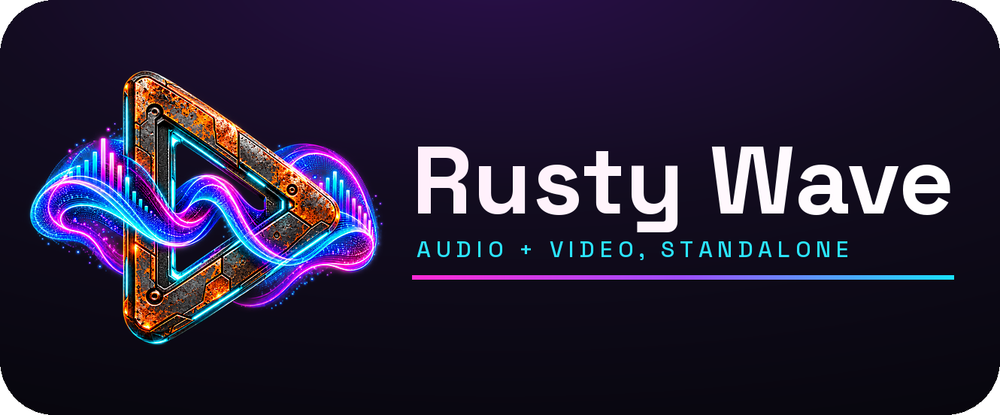
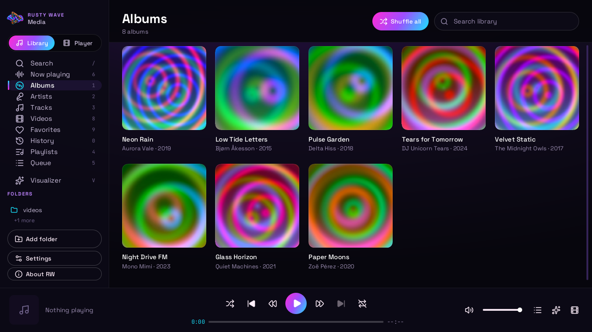
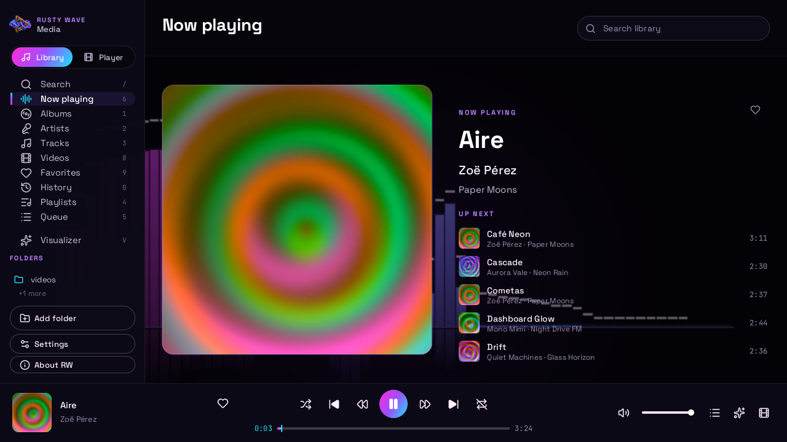
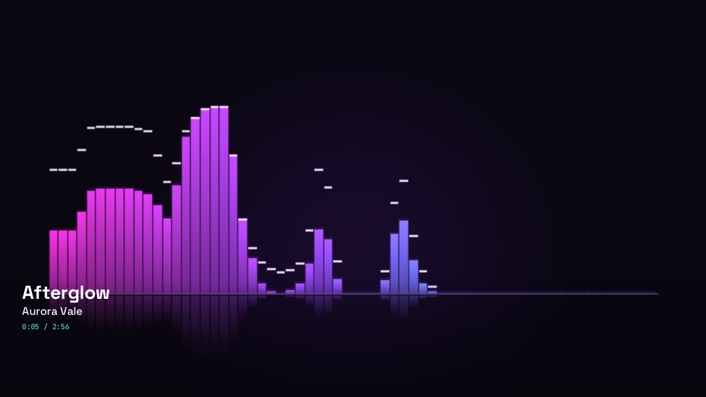

<p align="center">
  
</p>

<h1 align="center">Rusty Wave</h1>

<p align="center"><b>Music and video, played by Rust you can read.</b><br>
A fast, private media player for the desktop and the browser, with a library, a visualizer and no accounts.</p>

<p align="center">
  <a href="LICENSE-MIT"></a>
  <a href="https://software.rustybucket.ai/rusty-wave/latest/"></a>
</p>

<p align="center">
  
</p>

## Get it

- **Desktop** (Linux, Windows, macOS beta): [software.rustybucket.ai/rusty-wave/latest](https://software.rustybucket.ai/rusty-wave/latest/) has the AppImage, `.deb`, `.rpm`, Flatpak, tarball, Windows installer and zip, and the macOS dmg. Every file is signed, and the app checks for signed updates.
- **In your browser** (installable as an app, works offline): [wave.rustybucket.ai](https://wave.rustybucket.ai)
- **Inside Rusty Bucket**: it is the built-in Media app.

## What you get

- 🎵 **A music library**: albums, artists, tracks, search, cover art, playlists (M3U, M3U8, PLS), queue, favorites and history.
- 🎬 **Video that just plays**: H.264, HEVC, AV1 and VP9, decoded in Rust, with SRT, WebVTT, ASS and PGS subtitles.
- 🔊 **Gapless playback**, optional crossfade and an automatic loudness level.
- 🌈 **A built-in visualizer** with five effects.
- ⌨️ **Keyboard and mouse for everything**: press `H` or `?` for the list; a phone layout with touch-sized controls.
- 🔄 **Signed updates** on the desktop, and media keys and now-playing integration (MPRIS, Windows, the browser's media session).
- 🔒 **Private**: no accounts, no tracking, everything stays on your device.

| | |
| --- | --- |
| Containers | MP4, MKV, WebM; MP3, FLAC, Ogg, WAV, AAC files |
| Video | H.264, HEVC (Main, Main 10), AV1, VP9 |
| Audio | AAC, MP3, FLAC, Opus, Vorbis, PCM |
| Subtitles | SRT, WebVTT, ASS/SSA, PGS |
| Playlists | M3U, M3U8, PLS |

<p align="center">
  
  
</p>

## Roadmap

- **1.0.0**: the stable release, after more testing on other systems.
- **1.0.x**: shuffle's Back goes to what you actually played last.
- **1.1, media server (desktop)**, as optional drop-ins under a new Server tab:
  - DLNA/UPnP: browse servers, share your library to TVs, "Play To", send to TVs.
  - A home-network server for phones and browsers, with a phone remote.
  - Chromecast.
  - Jellyfin, Subsonic and Navidrome servers.
  - WebDAV folders.
  - Remux to MP4.
  - Built-in transcoding with our own H.264 and AAC encoders (planned).
- **1.2**, more drop-ins: SMB shares, internet radio and podcasts, multi-room playback, AirPlay.
- **Later, exploring**: Spotify, Apple Music and YouTube as remote-controlled services; faster HEVC (SIMD and threads).

Details: [docs/planning/v1.1-media-server.md](docs/planning/v1.1-media-server.md).

Suggestions, requests & bug reports welcome via X (https://x.com/djunicorntears) or GitHub issues (https://github.com/unicorntearsproject/rusty-media-player/issues).

## Build

```sh
source ~/.cargo/env             # the Rust toolchain lives in ~/.cargo/bin
cargo test --workspace          # native tests
cargo run --release -p rvp-host-desktop -- <files or folders>   # the desktop app
cargo xtask web && cargo xtask serve                            # the browser app on http://127.0.0.1:8080/
```

## Documentation

Everything else is in [docs/](docs/README.md): the [keys](docs/reference/keys.md), the [developer guide](docs/reference/development.md) (layout, build and test), the
[plan and architecture](docs/planning/PLAN.md), the [host interfaces](docs/reference/host-api.md), [packaging and releasing](docs/release/packaging.md) and the
[1.1 media-server plan](docs/planning/v1.1-media-server.md). Project rules for contributors: [CLAUDE.md](CLAUDE.md).

## License

Licensed under either of [Apache License, Version 2.0](LICENSE-APACHE) or [MIT license](LICENSE-MIT) at your
option. Third-party components and their licenses are listed in
[`THIRD_PARTY_LICENSES.md`](THIRD_PARTY_LICENSES.md). Clean-room: VLC was an architecture reference only; no VLC code is used.
